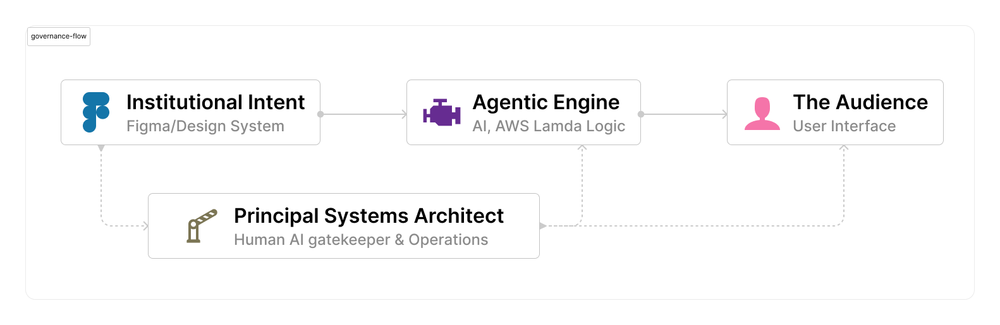

# C3 Jr. AI Orchestration Framework
### Strategic Direction & Institutional Architecture

---

**Project Role:** Architectural Director & Strategic Design Lead
**Stack:** AWS (Bedrock/Lambda/Step Functions), Figma (Design System), Agentic AI
**Institutional Impact:** 50% Reduction in OpEx // 30% Increase in Velocity

---

## Quick Navigation

| Document | Description |
|---|---|
| [📋 Governance Laws](governance/PROMPT_LAWS.md) | AI behavioral constraints & linguistic guardrails |
| [⚙️ System Logic](architecture/SYSTEM_LOGIC.md) | Agentic behavior trees & AWS orchestration strategy |
| [🎨 DesignOps Specs](design-ops/HANDOFF_SPECS.md) | Figma-to-AWS design token bridge & handoff protocols |

---

## Executive Summary
This repository contains the architectural blueprints and governance frameworks for **C3 Jr.**, an agentic AI mentor designed for the Mississippi Children's Museum. As the Architectural Director, I bridged the gap between institutional intent and technical execution, directing the "Blueprints" that governed the engineering build on AWS.

## The Architectural Vision
In an institutional setting, AI cannot be a "black box." It must be a governed asset. This framework ensures that:
1. **Pedagogy is Hard-Coded:** The AI follows socratic teaching methods, not just answering questions.
2. **The Realm is Secure:** Multi-layered guardrails protect young citizens (users) from uncurated AI behavior.
3. **The System Scales:** AWS-backed serverless architecture decouples growth from human headcount.

## DesignOps: The Figma-to-AWS Bridge
I implemented **Figma** as the central source of truth for the "Royal Engineers" (Developers). By establishing a federated design system within Figma, I ensured that every component on AWS met the museum's strict standards for brand integrity and WCAG 2.2 accessibility.

---

*Note: This repository serves as a portfolio of Architectural Direction and Strategic Leadership. Proprietary museum code has been abstracted to focus on the Governance Framework.*
